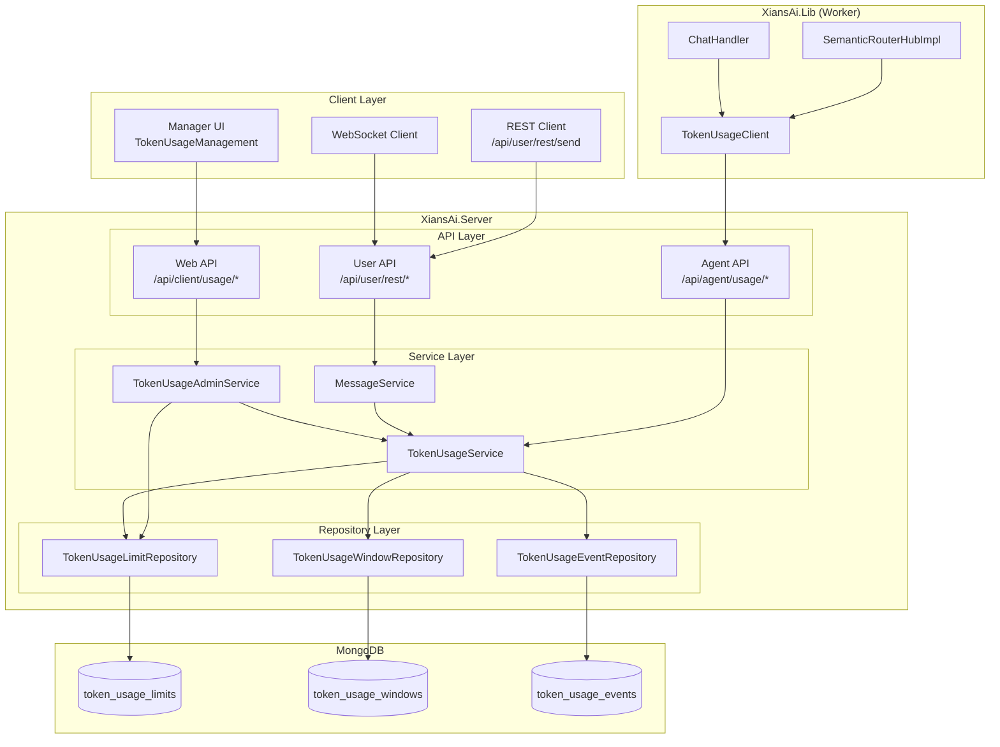
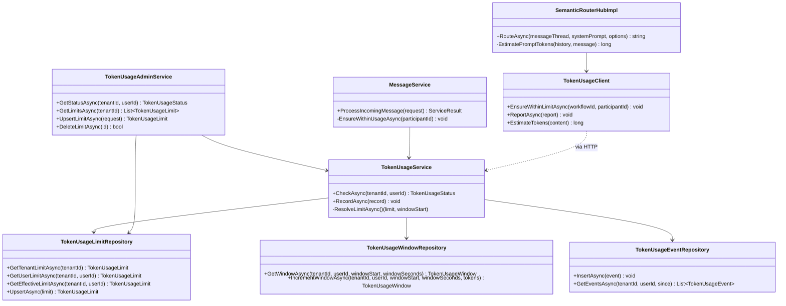
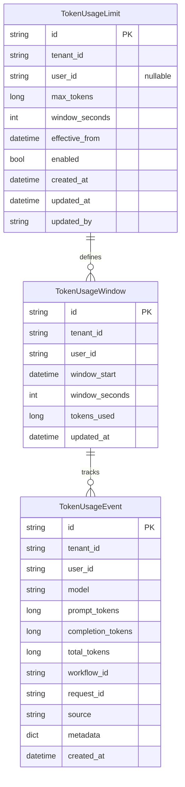
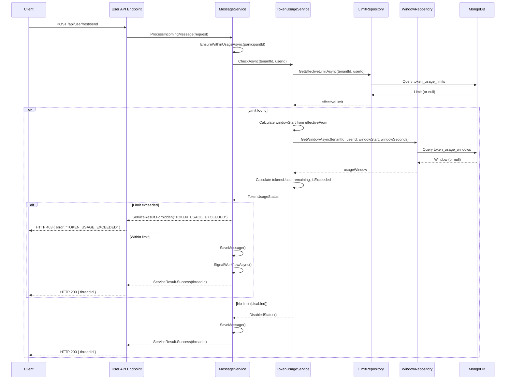
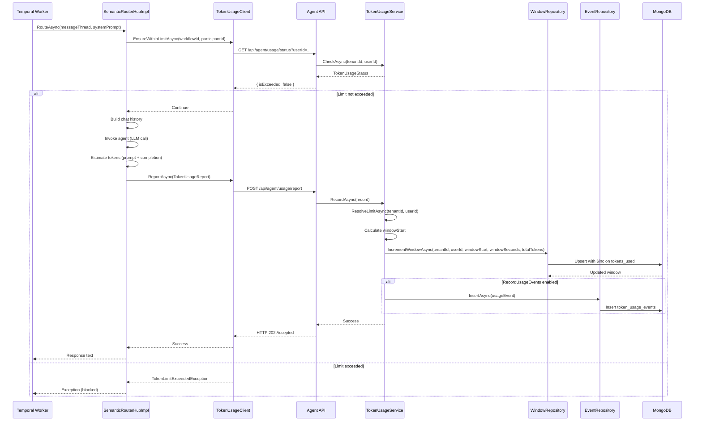
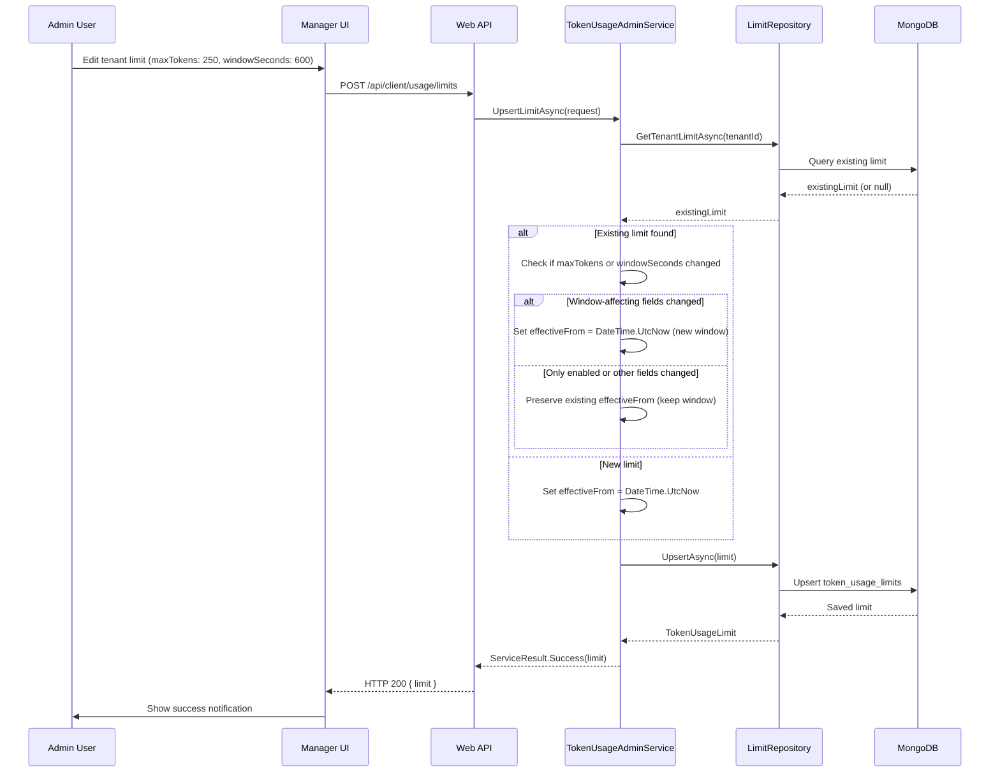
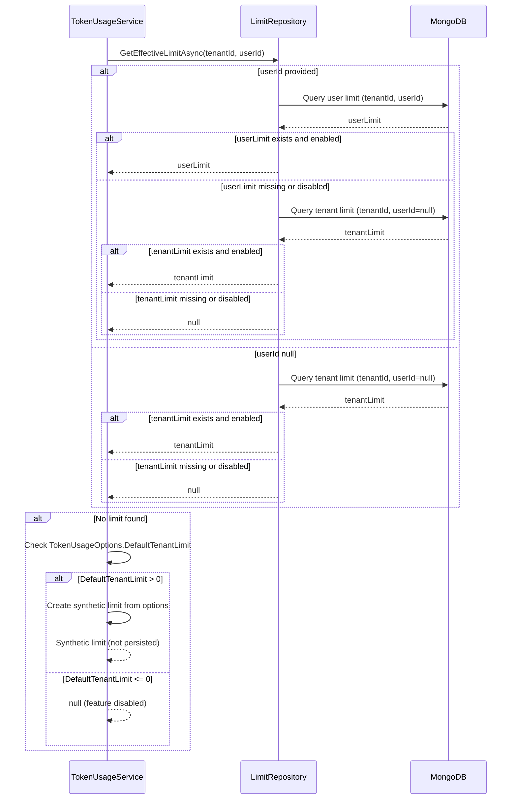

# Token Limiting Architecture Documentation

## Table of Contents
1. [Overview](#overview)
2. [System Architecture](#system-architecture)
3. [Component Architecture](#component-architecture)
4. [Data Model](#data-model)
5. [Sequence Diagrams](#sequence-diagrams)
6. [API Endpoints](#api-endpoints)
7. [Configuration](#configuration)
8. [Enforcement Flow](#enforcement-flow)
9. [Window Management](#window-management)

---

## Overview

The Token Limiting system enforces configurable token consumption limits per tenant and per user. It provides:

- **Per-tenant and per-user quotas** with rolling time windows
- **Real-time enforcement** at multiple entry points (REST, WebSocket, Worker)
- **Usage tracking and reporting** for observability
- **Administrative controls** via Manager UI and REST APIs

### Key Concepts

- **Tenant Default Limit**: Base quota applied to all users in a tenant unless overridden
- **User Override**: Per-user limit that replaces the tenant default for that specific user
- **Rolling Window**: Time-based window (e.g., 24 hours) that resets based on `EffectiveFrom` timestamp
- **Effective Limit Resolution**: User override > Tenant default > Global default (if configured)

---

## System Architecture



---

## Component Architecture

### Component Diagram



---

## Data Model

### Entity Relationship Diagram



### Data Model Details

#### TokenUsageLimit
- **Purpose**: Defines quota limits (max tokens, window duration) per tenant or user
- **Key Fields**:
  - `tenantId`: Required tenant identifier
  - `userId`: `null` for tenant-level limits, user ID for overrides
  - `maxTokens`: Maximum tokens allowed in the window
  - `windowSeconds`: Rolling window duration (60 to 2,592,000 seconds)
  - `effectiveFrom`: Timestamp from which the window calculation starts
  - `enabled`: Master switch for this limit
- **Indexes**: `{ tenantId: 1, userId: 1 }`

#### TokenUsageWindow
- **Purpose**: Tracks current usage within a specific time window
- **Key Fields**:
  - `tenantId`, `userId`: Composite key with window boundaries
  - `windowStart`: Calculated start of current window (aligned to `effectiveFrom`)
  - `windowSeconds`: Window duration (must match limit's `windowSeconds`)
  - `tokensUsed`: Accumulated token count (atomic increments)
- **Indexes**: `{ tenantId: 1, userId: 1, windowStart: -1 }`

#### TokenUsageEvent
- **Purpose**: Audit log of individual LLM invocations
- **Key Fields**:
  - `promptTokens`, `completionTokens`, `totalTokens`: Token counts
  - `source`: Origin of the call (e.g., "SemanticRouter.Route", "MarkdownService")
  - `workflowId`, `requestId`: Correlation identifiers
  - `metadata`: Additional context (workflowType, participantId, etc.)

---

## Sequence Diagrams

### 1. Message Processing with Token Check



### 2. Token Usage Recording (Worker Flow)



### 3. Limit Management (Admin UI Flow)



### 4. Effective Limit Resolution



---

## API Endpoints

### Web API (Manager UI)

| Endpoint | Method | Description | Auth |
|----------|--------|-------------|------|
| `/api/client/usage/status` | GET | Get current usage status for tenant/user | Tenant Admin |
| `/api/client/usage/limits` | GET | List all limits for tenant | Tenant Admin |
| `/api/client/usage/limits` | POST | Create/update limit | Tenant Admin |
| `/api/client/usage/limits/{id}` | DELETE | Delete limit | Tenant Admin |

### Agent API (Worker)

| Endpoint | Method | Description | Auth |
|----------|--------|-------------|------|
| `/api/agent/usage/status` | GET | Get usage status for certificate tenant/user | Certificate |
| `/api/agent/usage/report` | POST | Report token usage from LLM call | Certificate |

### User API (Client)

| Endpoint | Method | Description | Auth |
|----------|--------|-------------|------|
| `/api/user/rest/send` | POST | Send message (enforced) | API Key / JWT |

---

## Configuration

### TokenUsageOptions

```csharp
{
  "TokenUsage": {
    "Enabled": true,                    // Master feature flag
    "DefaultTenantLimit": 200000,       // Default quota when no limit configured
    "WindowSeconds": 86400,             // Default window (24 hours)
    "WarningPercentage": 0.8,           // Warn at 80% usage
    "RecordUsageEvents": true,          // Enable audit logging
    "MaxUsageHistoryDays": 30,          // Retention period
    "AllowUserOverrides": true          // Allow per-user limits
  }
}
```

### Environment Variables

- `TokenUsage:Enabled`: Feature toggle (default: `true`)
- `TokenUsage:DefaultTenantLimit`: Fallback quota (default: `200000`)
- `TokenUsage:WindowSeconds`: Default window duration (default: `86400`)

---

## Enforcement Flow

### Enforcement Points

1. **MessageService.ProcessIncomingMessage**
   - Checks limit before saving message
   - Throws `TokenLimitExceededException` if exceeded
   - Returns `ServiceResult.Forbidden("TOKEN_USAGE_EXCEEDED")`

2. **SemanticRouterHubImpl.RouteAsync** (Worker)
   - Checks limit before LLM invocation
   - Throws `TokenLimitExceededException` to abort workflow
   - Reports usage after successful LLM call

3. **SemanticRouterHubImpl.CompletionAsync** (Worker)
   - Checks limit before completion
   - Reports usage after completion

### Identity Resolution

- **Server-side**: Uses `TenantContext.LoggedInUser` (authenticated user)
- **Worker-side**: Uses `AgentContext.UserId` (from certificate)
- **ParticipantId**: Treated as display alias only, not used for quota enforcement

---

## Window Management

### Window Calculation

The rolling window is calculated based on:

1. **EffectiveFrom**: Timestamp when the limit was created or last modified (if window-affecting fields changed)
2. **WindowSeconds**: Duration of the window
3. **Current Time**: Used to determine which window period we're in

```csharp
// Pseudo-code
elapsedSeconds = (now - effectiveFrom).TotalSeconds
completedWindows = floor(elapsedSeconds / windowSeconds)
windowStart = effectiveFrom + (completedWindows * windowSeconds)
windowEndsAt = windowStart + windowSeconds
```

### Window Reset Behavior

- **New Limit**: `EffectiveFrom = DateTime.UtcNow` → Fresh window starts now
- **Limit Updated (maxTokens/windowSeconds changed)**: `EffectiveFrom = DateTime.UtcNow` → New window starts
- **Limit Updated (only enabled toggled)**: `EffectiveFrom` preserved → Existing window continues
- **Automatic Reset**: When `windowEndsAt < now`, next check calculates a new window

### Window Persistence

- Windows are keyed by `(tenantId, userId, windowStart, windowSeconds)`
- Old windows remain in database for historical analysis
- Only the current window (matching current `windowStart`) is used for enforcement

---

## Error Handling

### TokenLimitExceededException

- **Server**: Caught in `MessageService`, returns HTTP 403
- **Worker**: Propagated to workflow, aborts LLM call
- **Frontend**: Special-cased in `api-client.js` to show user-friendly toast instead of redirect

### Error Response Format

```json
{
  "error": "TOKEN_USAGE_EXCEEDED"
}
```

Frontend recognizes this and displays:
- Title: "Token Limit Exceeded"
- Message: "Token usage limit exceeded. You have reached your token quota for this period."
- Actions: ["Wait for the usage window to reset", "Contact your administrator", ...]

---

## Monitoring & Logging

### Log Events

1. **Pre-check**: `Token usage pre-check: tenant={TenantId}, user={UserId}, participant={ParticipantId}`
2. **Status**: `Token usage status: ... used={TokensUsed}, remaining={TokensRemaining}, max={MaxTokens}`
3. **Recording**: `Recording token usage: tenant={TenantId}, user={UserId}, totalTokens={TotalTokens}`
4. **Warning**: `Token usage warning for tenant {TenantId}, user {UserId}. Used={Used}/{Limit}` (at 80% threshold)
5. **Exceeded**: `Token usage exceeded for tenant {TenantId}, user {UserId}. Limit={Limit}, Used={Used}`

### Metrics (Future)

- `token.usage.total`: Total tokens consumed
- `token.usage.remaining`: Remaining quota
- `token.limit.exceeded`: Count of limit violations
- `token.window.reset`: Window reset events

---

## Testing Strategy

### Unit Tests

- `TokenUsageServiceTests`: Limit resolution, window calculation, exceeded conditions
- `MessageServiceTests`: Enforcement integration, error handling
- `TokenUsageAdminServiceTests`: Limit CRUD operations, window preservation

### Integration Tests

- `UsageEndpointsTests`: API endpoint validation, authorization
- `TokenUsageEndpointsTests`: Agent API status/report flows
- `MessageServiceIntegrationTests`: End-to-end message processing with limits

---

## Related Documentation

- [TOKEN_LIMITING_IMPLEMENTATION_PLAN.md](./TOKEN_LIMITING_IMPLEMENTATION_PLAN.md)
- [TOKEN_LIMITING_PHASES.md](./TOKEN_LIMITING_PHASES.md)
- [webapi/TOKEN_USAGE.md](./webapi/TOKEN_USAGE.md)
- [user-api/rest-api.md](./user-api/rest-api.md)

---

## Revision History

- **2024-11-26**: Initial architecture documentation
- Includes: Component diagrams, sequence diagrams, data models, enforcement flows

