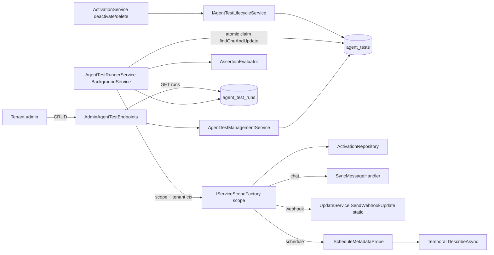
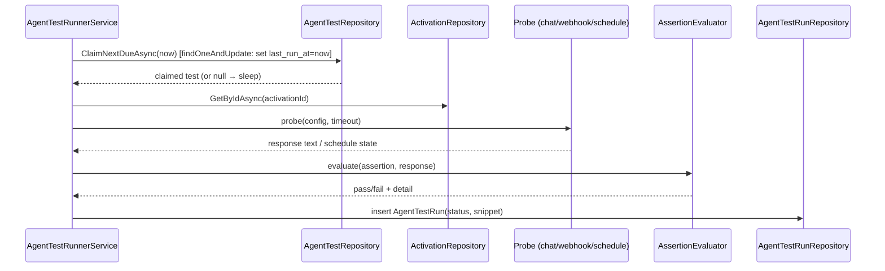

# Design: Automated agent health checks (Evals) — #517

**Item:** [#517 Introduce Evals/automated testing on xians server](https://github.com/XiansAiPlatform/XiansAi.Server/issues/517) · **Type:** Feature · **Size:** L

**One line:** Tenant admins configure chat / webhook / schedule health checks on an `AgentActivation`; a periodic runner executes them, evaluates deterministic assertions, and persists queryable pass/fail results (server-only — no alerting, no UI).

## 1. Context & scope

Once an agent is in production the only liveness signal today is the AdminApi heartbeat (worker up/down). Nothing checks the *correctness* of chat responses, inbound webhook behaviour, or schedule execution. This design delivers the server APIs to define, manage, and monitor deterministic health checks.

- **In scope:** AdminApi CRUD for test definitions; monitor/history query API; a periodic runner; three probe types (chat, inbound webhook, schedule metadata); assertion evaluation; result persistence; deactivation cascade; a single new capability.
- **Out of scope:** alerting / notification (separate follow-up issue, Q1); any UI (separate task, Q5); the outbound `WebhookDispatcherService`; synthetic schedule executions (Q3); non-substring / non-deterministic assertion operators; on-demand synchronous triggering.

## 2. Requirements & acceptance-criteria traceability

| Req / AC | Satisfied by |
|---|---|
| **R1** test defs attach to AgentActivation | `AgentTest` doc keyed by `tenant_id` + `activation_id` in **new** `agent_tests` collection (§5); create/update validate the activation exists (§6). See ADR-0012. |
| **R2** webhook uses **inbound** path | `AgentTestRunnerService` calls the already-Shared static `UpdateService.SendWebhookUpdate(...)` (`Shared/Utils/Temporal/UpdateService.cs`) — the exact call `WebhookReceiverService.ProcessWebhook` makes; never `WebhookDispatcherService` (§7.2). |
| **R3** schedule = metadata check | Runner calls **new** `Shared/Services/IScheduleMetadataProbe` reading `state.Paused` + `Info.RecentActions` via its own `DescribeAsync()` through `ITemporalGatewayFactory` (§7.3, ADR-0009). No synthetic execution. |
| **R4** periodic runner + persisted, queryable results | `AgentTestRunnerService : BackgroundService` (§7.4, ADR-0010); **multi-replica-safe** via a per-test atomic claim (D3 resolved — server is multi-replica); results in **new** `agent_test_runs`; `GET .../runs` endpoint (§6). |
| **R5** chat assertions contains / does-not-contain, case-insensitive | `AssertionEvaluator` using `IndexOf(..., OrdinalIgnoreCase)`; runner reuses `SyncMessageHandler` (§7.1). |
| **R6** single capability gates all access | **new** `CapabilityActions.TenantAgentTestsManage` + `.RequireCapability(...)` on every route (§8, ADR-0011). |
| **R7** per-test interval, min 5 min | `AgentTest.IntervalMinutes` validated `>= 5` on create/update (§5, §6). |
| **R8** deactivate/delete disables tests | **new** `IAgentTestLifecycleService.DisableTestsForActivationAsync` invoked from `ActivationService.DeactivateAgentAsync` / `DeleteActivationAsync` (§7.5). |
| AC create chat test w/ contains → persisted + scheduled | §6 POST; §7.4 runner picks up enabled tests. |
| AC chat run → response checked → pass/fail + snippet | §7.1. |
| AC webhook run → inbound trigger → pass/fail | §7.2. |
| AC schedule run → metadata queried → pass/fail | §7.3. |
| AC no-capability create/edit/delete → 403 | §8 `CapabilityMatrixFilter` → `CapabilityDenied`. |
| AC deactivated → due runs skipped, not errored | §7.4 runner skips `!activation.IsActive` before probing → `Status=Skipped`. |
| AC result retrievable, no alert | §6 `GET .../runs`; runner persists only, emits nothing. |

## 3. Architecture conformance

Constraints `ARCH-001..012` in `docs/architecture/constraints.md` are `Status: proposed` but authoritative — they codify live conventions.

| Constraint | How satisfied / deviation |
|---|---|
| ARCH-001 slice layout | New endpoints/services/config under `Features/AdminApi/{Endpoints,Services,Configuration}`; models/repos under `Shared/`. |
| ARCH-005 auth policy | Test endpoint group `.RequireAuthorization("AdminEndpointAuthPolicy")`. |
| ARCH-006 tenant isolation | Route `/tenants/{tenantId}/...` + `TenantRouteScopeFilter`; every doc carries `tenant_id` + `activation_id`; queries filter on both. |
| ARCH-007 repo-only Mongo | `AgentTestRepository`, `AgentTestRunRepository` in `Shared/Repositories` are the only `GetCollection<T>` holders. |
| ARCH-008 minimal API | Static `AdminAgentTestEndpoints` with `Map*`, no controllers. |
| ARCH-010 DI registration | Registered via `AdminApiConfiguration`; runner via `AddHostedService` in `SharedServices` (precedent: `ExpiredMessageFileCleanupService`). |
| **ARCH-003/004** no cross-feature / Shared→Features | **No deviation for new code.** The runner (Shared) sends webhook triggers via the already-Shared static `UpdateService.SendWebhookUpdate` (`Shared/Utils/Temporal/UpdateService.cs`) and reads schedule metadata via a new self-contained `IScheduleMetadataProbe` that uses only Shared Temporal primitives (ADR-0009) — neither references `Features/`. The runner does not reuse `ScheduleService` (`Features/WebApi`) precisely to avoid a Shared→Features reference. |

## 4. Components & real paths

**New**
- `XiansAi.Server.Src/Shared/Data/Models/AgentTest.cs` — test definition model.
- `XiansAi.Server.Src/Shared/Data/Models/AgentTestRun.cs` — run-result model.
- `XiansAi.Server.Src/Shared/Repositories/AgentTestRepository.cs` — CRUD + `ClaimNextDueAsync` (atomic `findOneAndUpdate` claim, multi-replica-safe — D3).
- `XiansAi.Server.Src/Shared/Repositories/AgentTestRunRepository.cs` — insert + paged query by test/activation.
- `XiansAi.Server.Src/Shared/Services/AgentTestRunnerService.cs` — `BackgroundService`; polls due tests, probes, evaluates, persists.
- `XiansAi.Server.Src/Shared/Services/AssertionEvaluator.cs` — case-insensitive contains / does-not-contain.
- `XiansAi.Server.Src/Shared/Services/AgentTestLifecycleService.cs` — `IAgentTestLifecycleService.DisableTestsForActivationAsync` (R8).
- `XiansAi.Server.Src/Shared/Services/ScheduleMetadataProbe.cs` — `IScheduleMetadataProbe`; own `DescribeAsync()` via `ITemporalGatewayFactory` returning exists / enabled / last-run status (ADR-0009).
- `XiansAi.Server.Src/Features/AdminApi/Endpoints/AdminAgentTestEndpoints.cs` — CRUD + runs query.
- `XiansAi.Server.Src/Features/AdminApi/Services/AgentTestManagementService.cs` — validation (interval ≥ 5, activation exists, kind/config/assertion consistency).

**Modified**
- `XiansAi.Server.Src/Features/AdminApi/Auth/CapabilityActions.cs` — add `TenantAgentTestsManage` const + `All` entry.
- `XiansAi.Server.Src/Features/AdminApi/Configuration/AdminApiConfiguration.cs` — register services; map endpoints.
- `XiansAi.Server.Src/Shared/Configuration/SharedServices.cs` — `AddHostedService<AgentTestRunnerService>()`; register repos, probe, lifecycle service.
- `XiansAi.Server.Src/Shared/Services/ActivationService.cs` — call `IAgentTestLifecycleService.DisableTestsForActivationAsync` in `DeactivateAgentAsync(activationId, tenantId)` and in `DeleteActivationAsync(activationId)` (tenantId sourced from the loaded activation — see §7.5).

No changes are needed to `Features/UserApi/Services/WebhookService.cs` or `Features/WebApi/Services/ScheduleService.cs`: the webhook probe reuses the already-Shared static `UpdateService.SendWebhookUpdate`, and the schedule probe is self-contained.

## 5. Data model

**Collection `agent_tests`** (`AgentTest`)

| Field | Bson | Notes |
|---|---|---|
| Id | `_id` ObjectId | |
| TenantId | `tenant_id` | ARCH-006; required |
| ActivationId | `activation_id` | R1 attachment key (separate collection — ADR-0012) |
| AgentName | `agent_name` | cached for probe/query without re-reading activation |
| Name | `name` | display name |
| Kind | `kind` | enum `Chat` / `Webhook` / `Schedule` |
| Enabled | `enabled` | R8 toggles this |
| IntervalMinutes | `interval_minutes` | R7, `>= 5` |
| ChatConfig | `chat_config` | `{ WorkflowType?, ParticipantId?, Message, TimeoutSeconds }` |
| WebhookConfig | `webhook_config` | `{ WorkflowType, MethodName, QueryParams, Body, TimeoutSeconds }` |
| ScheduleConfig | `schedule_config` | `{ ScheduleId }` |
| Assertion | `assertion` | `{ Operator: Contains \| NotContains, Value }` (chat/webhook) |
| CreatedBy / CreatedAt / UpdatedAt | | audit |
| LastRunAt | `last_run_at` | nullable; runner due-check |

Indexes: `{ tenant_id, activation_id }`; `{ enabled, last_run_at }` (runner due-scan).

**Collection `agent_test_runs`** (`AgentTestRun`)

| Field | Bson | Notes |
|---|---|---|
| Id | `_id` | |
| TenantId / ActivationId / TestId | | scoping + join |
| Passed | `passed` | bool |
| Detail | `detail` | reason string |
| ResponseSnippet | `response_snippet` | truncated (≤ 500 chars) response |
| RanAt | `ran_at` | timestamp |
| DurationMs | `duration_ms` | |
| Status | `status` | `Passed` / `Failed` / `Skipped` / `Error` |

Indexes: `{ test_id, ran_at desc }`; `{ tenant_id, activation_id, ran_at desc }`; **TTL index on `ran_at` with a 30-day expiry** to bound growth (D2 resolved — default accepted; window made configurable later).

## 6. Interfaces / API

Group: `adminApiGroup.MapGroup("/tenants/{tenantId}/agentTests").RequireAuthorization("AdminEndpointAuthPolicy").AddEndpointFilter<TenantRouteScopeFilter>().EnforceCapabilities();` — every route `.RequireCapability(CapabilityActions.TenantAgentTestsManage)` (R6).

| Method | Route | Body / query | Response |
|---|---|---|---|
| POST | `` | `CreateAgentTestRequest` | `201` `AgentTestDto` |
| GET | `` | `?activationId=` | `AgentTestDto[]` |
| GET | `/{testId}` | | `AgentTestDto` |
| PUT | `/{testId}` | `UpdateAgentTestRequest` | `AgentTestDto` |
| DELETE | `/{testId}` | | `204` |
| GET | `/{testId}/runs` | `?limit=&before=` | `AgentTestRunDto[]` (monitor/history, R4) |

Validation (`AgentTestManagementService`): `IntervalMinutes >= 5` else `400` (R7); referenced `activationId` must exist and belong to the route tenant else `404`; `kind` must match the provided config block; chat/webhook require an `assertion`.

## 7. Key flows

### Shape

### Flow — periodic run (happy path)

Failure / edge rows:

| Condition | Runner behaviour | Persisted |
|---|---|---|
| Activation missing or `!IsActive` (R8, AC deactivated) | skip probe | `Status=Skipped`, no error, `last_run_at` advanced |
| Chat/webhook timeout | catch | `Status=Failed`, detail "timeout", snippet empty |
| Probe throws unexpected | catch per-test (loop continues) | `Status=Error`, detail = message |
| Assertion `NotContains` matched | evaluate | `Status=Failed` |
| Schedule paused / missing / no recent actions (R3) | evaluate metadata | `Status=Failed`, detail = which check failed |

### 7.1 Chat probe (R5)
Runner builds `workflowId` via `WorkflowIdentifier.BuildWorkflowId(tenant, agentName, workflowType, activationName)`, constructs a `Chat` request mirroring `AdminHeartbeatEndpoints`, and calls `SyncMessageHandler.ProcessSyncMessageAsync(..., MessageType.Chat, timeoutSeconds, ct)` (already in `Shared/Utils`). Response `Text` → `AssertionEvaluator` using `text.IndexOf(value, StringComparison.OrdinalIgnoreCase) >= 0`. Snippet = first 500 chars of `Text`.

### 7.2 Webhook probe (R2)
Inside the per-test DI scope (§7.4), the runner calls the already-Shared static `UpdateService.SendWebhookUpdate(workflow, methodName, queryParams, body, tenantContext, temporalGatewayFactory, agentService)` — the exact call `WebhookReceiverService.ProcessWebhook` makes (`WebhookService.cs:65`). This is a pure Shared utility, so no interface extraction and no cross-feature reference is introduced. The returned `WebhookResponse` body → assertion. Outbound `WebhookDispatcherService` is never touched.

### 7.3 Schedule probe (R3, ADR-0009)
`IScheduleMetadataProbe.CheckAsync(tenantId, agentName, scheduleId)` obtains a Temporal client via `ITemporalGatewayFactory`, then `GetScheduleHandle(scheduleId).DescribeAsync()`. Pass iff: schedule exists (no `not found`), `!state.Paused` (enabled), and `Info.RecentActions` non-empty (a last run is present). Detail names the first failing condition. The probe is self-contained (does its own `DescribeAsync`) and does not depend on `ScheduleService`. No synthetic execution.

### 7.4 Runner mechanism (R4/R7, ADR-0010)
`BackgroundService` (not a Temporal schedule), following `ExpiredMessageFileCleanupService`. Loop: initial delay → every ~1 min, atomically claim and process due tests one at a time, `Task.Delay` between cycles, each claim/probe in its own try/catch.

**Multi-replica claim (D3 — resolved: server is multi-replica).** The server runs multiple replicas, so a plain due-scan (`find` where `last_run_at + interval <= now`) would let two replicas probe the same test in the same window. Instead the runner claims each due test atomically: `AgentTestRepository.ClaimNextDueAsync(now)` issues a single `findOneAndUpdate` that matches `{ enabled: true, $expr: last_run_at + interval_minutes <= now }` and, in the same operation, sets `last_run_at = now` (the claim), returning the claimed document (or null when none remain). Because Mongo `findOneAndUpdate` is atomic per document, only one replica wins each test per window; the runner loops on `ClaimNextDueAsync` until it returns null, then sleeps. The `{ enabled, last_run_at }` index (§5) backs the match. Advancing `last_run_at` at claim time (rather than after the probe) both records the claim and prevents re-claim within the interval; the run result is written to `agent_test_runs` when the probe completes. A stale-claim risk (a replica that crashes mid-probe) is acceptable for v1 — the test simply runs again next interval — and can be tightened later with a short claim lease if needed.

**Per-test DI scope + tenant context.** `ITenantContext` is registered `AddScoped` (`SharedServices.cs:39`) and both the chat path and `UpdateService.SendWebhookUpdate` read `TenantId` / `ParticipantId` / temporal config from it. A `BackgroundService` has no HTTP request scope, so for **each** due test the runner: (1) creates a scope via `IServiceScopeFactory.CreateScope()`, (2) resolves `ITenantContext` from that scope and populates it (TenantId, ParticipantId, and per-tenant temporal config) from the persisted `AgentTest` before invoking the chat/webhook probe, (3) resolves the repositories/probe from the same scope, (4) disposes the scope after the run. (`ExpiredMessageFileCleanupService` needs no tenant context and so is a precedent only for the loop shape, not for scoping.)

Chosen over a Temporal schedule to avoid the self-referential failure-masking risk (a Temporal-scheduled probe of Temporal would not fire when Temporal is down — hiding the very failures these tests exist to detect). See §8 and ADR-0010.

### 7.5 Deactivation cascade (R8)
Both `ActivationService.DeactivateAgentAsync(activationId, tenantId)` and `DeleteActivationAsync(activationId)` (Shared) call `IAgentTestLifecycleService.DisableTestsForActivationAsync(tenantId, activationId)`, setting `enabled=false` on all matching `agent_tests`. `DeleteActivationAsync` takes only `activationId`, so `tenantId` is read from the loaded `activation` document before the disable call (matching how that method already derives tenant scope). Because the runner filters `enabled` and re-checks `IsActive`, no orphaned tests run — and there is no Temporal schedule namespace to clean (runner is a BackgroundService), which removes the brief's cleanup-namespace tension.

**Caveat (delete path):** `DeleteActivationAsync` is guarded by a running-workflow conflict check (`ActivationService.cs:774`) and returns a conflict without deleting when workflows are still running. Tests are therefore disabled via the **deactivate** path (the normal lifecycle); on delete they are disabled only once the delete actually proceeds. This is acceptable because deactivation is the operation that stops the agent; a delete blocked by running workflows leaves the activation `IsActive`, and the runner's `IsActive` re-check still governs whether probes run.

## 8. Cross-cutting

- **Auth/capability (R6):** single `TenantAgentTestsManage` action gates create/edit/view/delete; SysAdmin bypass via existing `CapabilityMatrixFilter`; no-capability → `CapabilityDenied` (403). Default roles: `[TenantAdmin]` (ADR-0011 / D1).
- **Tenant isolation:** `TenantRouteScopeFilter` on the route group; repos filter `tenant_id` + `activation_id`; the runner has no request scope, so it establishes a per-test scope and populates `ITenantContext` from the persisted `AgentTest` before probing (§7.4).
- **Scoped services in a BackgroundService:** the runner is a singleton; `ITenantContext` and request-scoped dependencies must be resolved from a `IServiceScopeFactory.CreateScope()` per test, not captured in the constructor. This is the main correctness pitfall of the runner and is called out in the implementation plan (§11).
- **Multi-replica safety (D3):** the server runs multiple replicas; the atomic `ClaimNextDueAsync` (`findOneAndUpdate` claiming `last_run_at`) guarantees at-most-one replica probes a given test per interval (§7.4).
- **Error handling:** per-test try/catch in the runner loop guarantees one failing probe never aborts the sweep; deactivated activations produce `Skipped`, not `Error` (AC).
- **Timeouts:** chat/webhook use per-test `TimeoutSeconds` (bounded 1–30, as in `AdminHeartbeatEndpoints`); schedule probe bounded by the Temporal RPC.
- **Logging:** structured logs per run with `LogSanitizer` on tenant/agent/schedule ids (matches existing services).
- **Self-referential Temporal risk:** chat and webhook probes both traverse Temporal; if Temporal is down those tests correctly record `Failed`/`Error` (a real signal) while the BackgroundService keeps running, so failures surface rather than being masked. A Temporal-schedule runner would have hidden them (ADR-0010).

## 9. Decisions (resolved)

All three decisions are resolved (hasith, 2026-09-29); none remain open.

- **D1 — Capability default roles / delegable.** *Resolved: default accepted.* `TenantAgentTestsManage` gated to `[TenantAdmin]`, delegable (not `NonDelegable`), matching other tenant-scoped management actions (§8, ADR-0011).
- **D2 — Run-result retention.** *Resolved: default accepted.* TTL index on `agent_test_runs.ran_at` with a 30-day expiry to bound growth (§5); the window is made configurable later.
- **D3 — Runner scale / distributed lock.** *Resolved: server is multi-replica.* The runner claims each due test atomically via `AgentTestRepository.ClaimNextDueAsync` (`findOneAndUpdate` setting `last_run_at` in the same operation), so only one replica runs each test per interval (§7.4, ADR-0010). This is built into v1, not deferred.

## 10. Proposed ADRs

This design requires four ADRs (0009–0012), added under `docs/architecture/decisions/`:

- **ADR-0009** — Schedule metadata probe as an independent read-only Shared service (R3; no `ScheduleService` refactor).
- **ADR-0010** — Test runner is a BackgroundService, not a Temporal schedule (R4/R7; self-referential risk).
- **ADR-0011** — Single capability gates all agent-test operations (R6).
- **ADR-0012** — Store test definitions in a separate collection, not embedded in AgentActivation (R1).

R2's inbound webhook path needs no ADR: `UpdateService.SendWebhookUpdate` is already a static utility in `Shared/Utils/Temporal/`, so the runner calls it directly with no cross-feature reference.

## 11. Implementation plan

1. Models + repos: `AgentTest`, `AgentTestRun`, `AgentTestRepository` (incl. atomic `ClaimNextDueAsync`, D3), `AgentTestRunRepository` (indexes incl. 30-day TTL on `ran_at`, D2). Register in `SharedServices`.
2. `IScheduleMetadataProbe` / `ScheduleMetadataProbe` (ADR-0009): self-contained read-only `DescribeAsync()` via `ITemporalGatewayFactory` → exists / enabled / last-run status. No changes to `ScheduleService` or `WebhookService`. Unit tests with a mocked Temporal client.
3. `AssertionEvaluator` (R5) + tests.
4. `AgentTestManagementService` (validation: interval ≥ 5, activation exists, kind/config/assertion consistency).
5. `AdminAgentTestEndpoints` (CRUD + `/runs`); add `TenantAgentTestsManage` to `CapabilityActions`; wire in `AdminApiConfiguration`.
6. `AgentTestRunnerService : BackgroundService`: per cycle, loop on `ClaimNextDueAsync` (atomic per-test claim, multi-replica-safe, D3) until null; **per claimed test, open an `IServiceScopeFactory` scope and populate `ITenantContext`** (§7.4), then activation `IsActive` gate, three probes (chat via `SyncMessageHandler`, webhook via static `UpdateService.SendWebhookUpdate`, schedule via `IScheduleMetadataProbe`), evaluate, persist. `AddHostedService` in `SharedServices`.
7. `AgentTestLifecycleService` + hooks: `ActivationService.DeactivateAgentAsync(activationId, tenantId)` and `DeleteActivationAsync(activationId)` (tenantId from loaded doc) (R8).
8. Integration tests (ARCH-011, Mongo2Go + mocked `ITemporalGatewayFactory`): each AC — chat pass/fail + snippet, webhook, schedule, 403, deactivated→skipped, run retrievable. Include a test that the runner resolves `ITenantContext` per test scope correctly.
9. Add a concurrency integration test asserting two runner instances never double-run a single due test (D3 claim). D1/D2/D3 are all resolved (§9) — no pre-implementation decisions remain.
